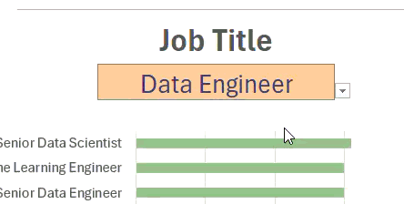

# Excel Salary Dashboard


## Introduction

This data jobs salary dashboard was created to help job seekers investigate salaries for their desired jobs and ensure they are being adequately compensated for their desired job title, location and skills. It could also be used by Data Analytics recruiters who are trying to better understand what are the current skill trends, salary ranges and other market insights about data roles so they can optimize the recruitment process.

The dataset used comes from [kaggle](https://www.kaggle.com/datasets/lukebarousse/data-analyst-job-postings-google-search/data) . The data contains detailed information on job titles, salaries, locations, and essential skills that are presented here.

### Dashboard File
📊 [My final dashboard ](salary_dashboard_final.xlsx)

### Excel Skills Used

The following Excel skills were utilized for analysis:

- **📉 Charts**
- **🧮 Formulas and Functions**
- **❎ Data Validation**

### 📂 Data Jobs Dataset


The dataset used for this project contains real-world data science job information from 2025, sourced from [kaggle](https://www.kaggle.com/datasets/lukebarousse/data-analyst-job-postings-google-search/data). 

This analysis is especially valuable for individuals exploring career opportunities in the data industry or looking to advance their existing roles. The dashboard offers a wealth of insights that can help job seekers identify which skills, job titles, and regions align best with their salary expectations and career goals.
The dataset includes detailed information on:
 
- **👨‍💼 Job titles**
- **💰 Salaries**
- **📍 Locations**
- **🛠️ Skills**

## Dashboard Build

### 📉 Charts

#### 📊 Data Science Job Salaries - Bar Chart


- 🛠️ **Excel Features:** Utilized bar chart feature (with formatted salary values) and optimized layout for clarity.
- 🎨 **Design Choice:** Horizontal bar chart for visual comparison of median salaries.
- 📉 **Data Organization:** Sorted job titles by descending salary for improved readability.
- 💡 **Insights Gained:** This enables quick identification of salary trends, noting that Senior roles and Engineers are higher-paying than Analyst roles.

#### 🗺️ Country Median Salaries - Map Chart


- 🛠️ **Excel Features:** Utilized Excel's map chart feature to plot median salaries globally.
- 🎨 **Design Choice:** Color-coded map to visually differentiate salary levels across regions.
- 📊 **Data Representation:** Plotted median salary for each country with available data.
- 👁️ **Visual Enhancement:** Improved readability and immediate understanding of geographic salary trends.
- 💡 **Insights Gained:** Enables quick grasp of global salary disparities and highlights high/low salary regions.

### 🧮 Formulas and Functions

#### 💰 Median Salary by Job Titles

```
=MEDIAN(
IF(
    (jobs[job_title_short]=A2)*
    (jobs[job_country]=country)*
    (ISNUMBER(SEARCH(type,jobs[job_schedule_type])))*
    (jobs[salary_year_avg]<>0),
    jobs[salary_year_avg]
)
)
```

- 🔍 **Multi-Criteria Filtering:** Checks job title, country, schedule type, and excludes blank salaries.
- 📊 **Array Formula:** Utilizes `MEDIAN()` function with nested `IF()` statement to analyze an array.
- 🎯 **Tailored Insights:** Provides specific salary information for job titles, regions, and schedule types.
- **🔢 Formula Purpose:** This formula populates the table below, returning the median salary based on job title, country, and type specified.

🍽️ Background Table


📉 Dashboard Implementation


#### ⏰ Count of Job Schedule Type

```
=FILTER(J2#,(NOT(ISNUMBER(SEARCH("and",J2#))+ISNUMBER(SEARCH(",",J2#))))*(J2#<>0))
```

- 🔍 **Unique List Generation:** This Excel formula below employs the `FILTER()` function to exclude entries containing "and" or commas, and omit zero values.
- **🔢 Formula Purpose:** This formula populates the table below, which gives us a list of unique job schedule types.

🍽️ Background Table

  
📉 Dashboard Implementation:


### ❎ Data Validation

#### 🔍 Filtered List

- 🔒 **Enhanced Data Validation:** Implementing the filtered list as a data validation rule under the `Job Title`, `Country`, and `Type` option in the Data tab ensures:
    - 🎯 User input is restricted to predefined, validated schedule types
    - 🚫 Incorrect or inconsistent entries are prevented
    - 👥 Overall usability of the dashboard is enhanced



## 🏁 Conclusion

This dashboard provides a clear, data-driven overview of salary trends across the data industry — covering roles such as Data Analyst, Data Engineer, and Data Scientist. I was able to identify how location, role, and skill set directly influence earning potential.

From a stakeholder perspective, this project demonstrates how salary analytics can guide recruitment strategies, talent development, and career planning. For job seekers, it highlights the skills most correlated with higher compensation and offers transparency into global market trends in the data domain.

Overall, this project strengthened my ability to transform raw job market data into actionable insights using Excel.
