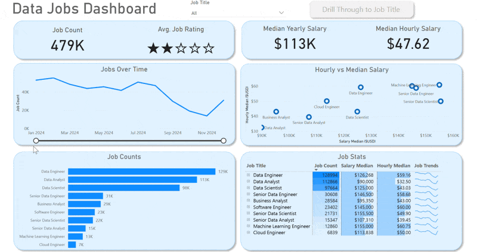
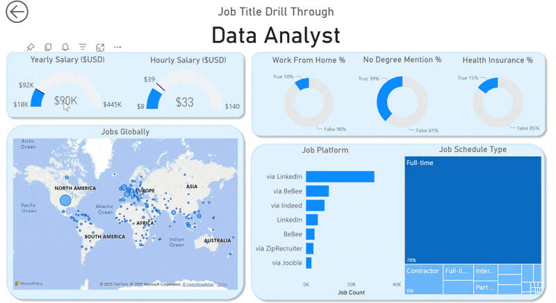
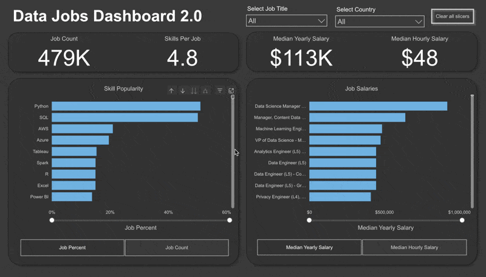

# Data Jobs Dashboard — Power BI Case Study

## Introduction

The Data Jobs Dashboard was created to help job seekers, career changers, and business stakeholders better understand the evolving data-job landscape in 2024.
Information about salaries, hiring demand, and skill trends is often fragmented across platforms like LinkedIn, Indeed, and Glassdoor.
This project consolidates those insights into a single, interactive Power BI dashboard that makes the job market transparent, measurable, and actionable.

The dataset comes from [here](https://www.kaggle.com/datasets/lukebarousse/data-analyst-job-postings-google-search/data),  real-world job postings throughout 2024, includes detailed information on job titles, salaries, company locations, and key skills in demand.
The analysis focuses on uncovering how data roles performed in 2024, highlighting salary trends, demand fluctuations, and skill evolution across quarters,  insights critical for both job seekers and recruitment teams.

---

### Dashboard 1  — Exploratory Dashboard:

The first iteration served as a **high-level market overview**.
It provided an interactive interface for exploring job counts, median salaries, and job-title distributions while tracking hiring behavior over time.
Users could filter by role or drill down to a specific job title, enabling personalized insight into their target position.

Key KPIs and visuals included:
- **Job Count & Trends**: Total 479K openings tracked across 2024, revealing clear quarterly cycles, notably strong hiring in Q1 and Q3 aligned with fiscal planning periods.  
- **Median Salary**: $113K annually (≈ $48 hourly), showing healthy compensation consistency across the year despite fluctuations in demand.  
- **Job Counts by Title**: Data Engineer (≈ 129K) and Data Analyst (≈ 113K) led the market, with Data Scientists (≈ 98K) close behind.  
- **Hourly vs Median Salary Analysis**: Senior and engineering-focused roles continued to command the highest premiums.  
- Users could then **drill through** to specific roles for additional context.

---

### Drill-Through View — Job Title Deep Dive

### The drill-through page allowed a focused analysis by job title, including:

 

The drill-through page allowed a focused analysis by job title, including:

- **Salary Ranges**: For example, Data Analyst median ≈ $90K, with hourly averages ≈ $33.
- **Work-from-Home and Benefits**: Roughly 10% of postings offered full remote work; 15% explicitly listed health insurance.
- **Hiring Platforms**: LinkedIn and Indeed dominated global recruitment sources.
- **Geographic Spread**: North America and Europe remained the largest data-job markets, with Asia showing steady growth.

This page was especially valuable for recruiters and HR analysts seeking to benchmark specific roles or regions.

---

### Dashboard 2 — Executive Overview:

Building on insights from the exploratory dashboard, Dashboard 2.0 streamlined the experience into a single, executive-friendly interface.
It retained all core metrics but prioritized clarity, speed, and high-impact visuals for decision-making.

Key insights surfaced through V2.0:

- **Market Scale**: ≈ 479K open data-role postings captured in 2024.
- **Skills Per Job**: Average 4.8 skills per listing, illustrating how job complexity and expectations have grown.
- **Top Skills by Demand**: Python and SQL dominate (> 50% of listings), while AWS and Azure reflect strong cloud integration trends.
- **Median Yearly Salary**: $113K, reinforcing 2024 as a stable year for compensation despite tech market volatility.
- **Top Paying Roles**: Senior Data Scientist and Machine Learning Engineer both averaged > $160K, outpacing traditional data engineering roles.

Together, these insights create a comprehensive 2024 market snapshot, revealing how demand, skill requirements, and pay evolved throughout the year.

---

### Business Impact & Relevance

This analysis highlights several patterns that matter to executives and job seekers alike:

- **Hiring Cycles**: Quarterly spikes (Q1 & Q3) reflect budget cycles and project kick-offs, critical for recruiters to plan talent pipelines.
- **Skill Inflation**: An average of 4.8 skills per job indicates a tight market where multidisciplinary analysts (SQL + Python + cloud tools) command premium offers.
- **Salary Differentiation**: Technical roles (Data Engineering, ML) remain top-tier earners, while analyst positions maintain high demand due to their business communication value.
- **Remote Work**: Global remote positions grew steadily, validating the viability of six-figure remote analytics careers.

For *stakeholders*, the dashboard provides a data-driven lens on market conditions to guide recruitment strategy, budget allocation, and skill development planning.
For *job seekers*, it offers clarity on which roles and skills provide the best career ROI and geographic mobility.

---

### Conclusion

The Power BI Data Jobs Dashboard demonstrates how large-scale, unstructured job-market data can be transformed into a clear business-intelligence story.
By leveraging 2024 data to identify high-demand roles, emerging skill clusters, and compensation trends, the project bridges the gap between career insight and strategic workforce planning.

The first version provided an exploratory foundation; the second refined that into an executive decision-support tool fit for recruitment teams, analysts, and career advisors.
Future iterations will expand into 2025 data and introduce quarterly comparisons and forecasting for trend validation and budget forecast alignment.

### Recommendations and Next Steps  
**For Business Stakeholders**:

- Use this dashboard as a strategic workforce tool to track demand cycles, benchmark compensation, and forecast hiring needs.
- Identify high-demand skills (SQL, Python, cloud technologies) for targeted upskilling and retention programs.
- Integrate this framework into internal HR analytics systems for real-time labor market monitoring.

**For Job Seekers**:

- Focus learning efforts on the intersection of data analysis and automation (SQL + Python + BI tools) to maximize salary potential.
- Leverage insights from regional and job-type trends to plan applications strategically — targeting high-growth quarters or industries.
- Build similar dashboards for personal career tracking — turning job data into a personal analytics strategy.

**Next Steps**:

- Expand this dashboard to cover Q1–Q2 2025 and track evolving salary patterns post-2024.
- Add forecasting and trend decomposition visuals to predict market direction.
- Combine insights with the ChatGPT AI Analysis layer to automate insight generation and provide real-time narrative summaries for executive reports.

---
This project showcases how Power BI can bridge the gap between data analysis and storytelling,  transforming raw job-market data into actionable insights that empower both individuals and organizations.